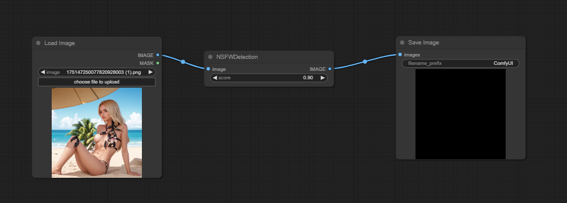

# This is an implementation of NSFW Detection for ComfyUI

## Project Overview

This project is designed to detect whether images generated by ComfyUI are Not Safe For Work (NSFW). It uses a machine learning model to classify images as either safe or not safe for work. If an image is classified as NSFW, an alternative image is returned.

## Install

1. Clone this repo into custom_nodes directory of ComfyUI location

2. Run pip install -r requirements.txt

## Usage

The main functionality of the project is encapsulated in the `NSFWDetection` class in the `node.py` file. This class has a `run` method that takes three parameters:

- `image`: The image to be classified.
- `score`: The threshold score for classifying an image as NSFW.
- `alternative_image`: The image to be returned if the input image is classified as NSFW.

## Example

https://github.com/trumanwong/ComfyUI-NSFW-Detection/blob/main/workflow.json

## Contributing

Contributions are welcome. Please submit a pull request if you have any improvements or bug fixes.

## License

This project is licensed under the terms of the MIT license.